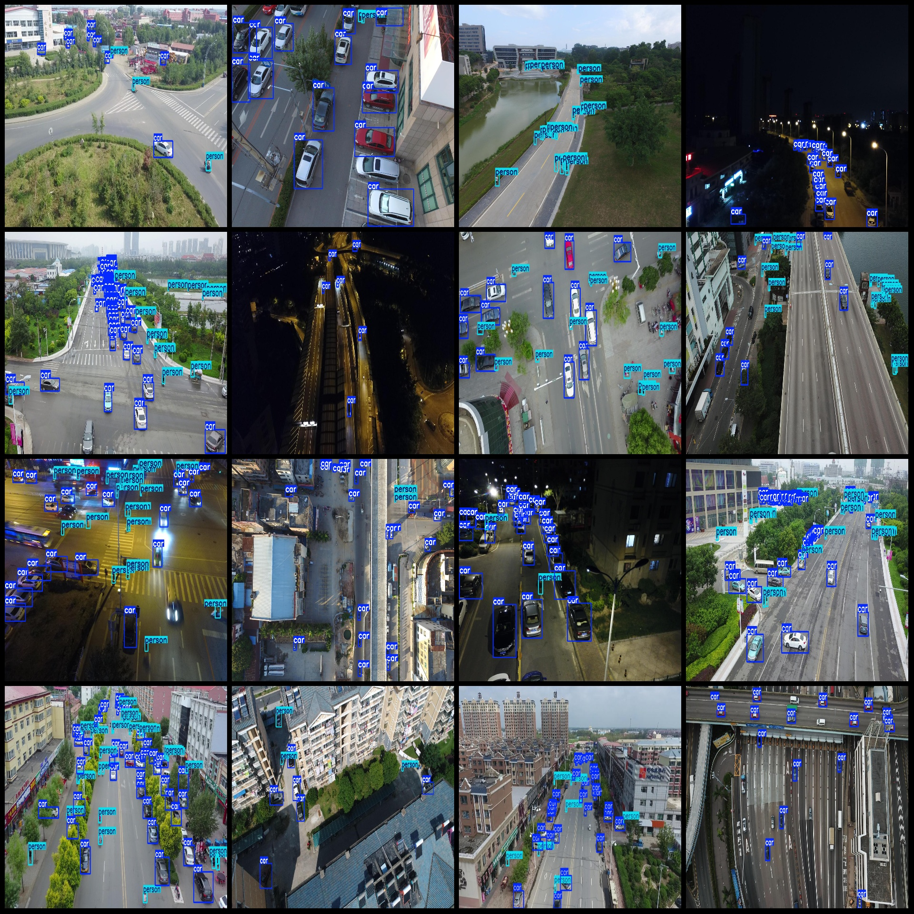
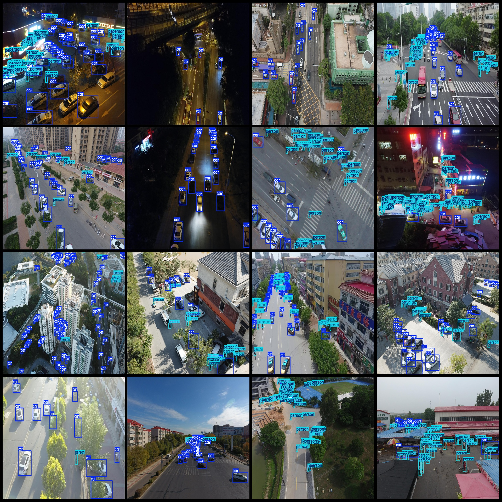

# Drone Viewpoint City Street Pedestrians and Vehicle Detection Dataset VOC+YOLO Format with 5291 Images in 2 Categories

Dataset Format: Pascal VOC format + YOLO format (without split path txt files, just containing jpg images as well as the corresponding VOC format xml files and YOLO format txt files)
Number of Images (jpg file count): 5291
Number of Annotations (xml file count): 5291
Number of Annotations (txt file count): 5291
Number of Annotation Categories: 2
Annotation Category Names (Note that the order of categories in the YOLO format does not correspond to this, but is based on the labels folder's classes.txt): ["car", "person"]
Box Count per Category:
car box count = 119670
person box count = 90711
Total Boxes: 210381
Image Resolution: Multi-resolution images, such as 1360x765, 1400x788, etc.
Drone: DJI MAVIC 3
Collection Height: 20-50m
Collection Angle: 60-90°
Used Labeling Tool: labelImg
Labeling Rules: Draw a rectangle around each category
Important Notice: The dataset does not have been divided into training, validation, and test sets; you need to divide them yourself.
Special Disclaimer: This dataset does not guarantee the accuracy of trained models or weight files.
Image Preview:
Annotation Example:

## Images

Here is a pay link on Stripe ( https://buy.stripe.com/3cs8yP7sY87d0vu9AB ). Please contact me lonlonago@foxmail.com after funding $89, and I will send you a complete data files , thank you!

